# NMAP
- [NMAP Command Cheat Sheet](https://www.golinuxcloud.com/nmap-command-in-linux/)

## Domain IP Address Lookup
| Command | Description |
|---|---|
|`nslookup cloudflare.com`|Lookup domain IP address|
||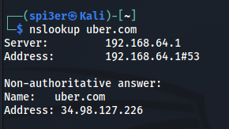|

## Scan Techniques
| Command | Description |
|---|---|
|`nmap 192.168.1.1 -sT`|TCP connect port scan (Default without root privilege)
||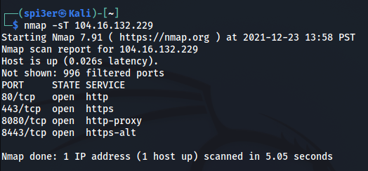|
|`nmap 192.168.1.1 -sU`|UDP port scan|
||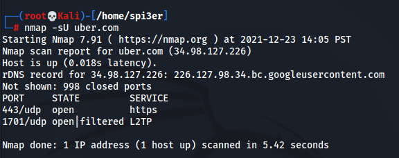|

## Host Discovery
| Command | Description |
|---|---|
|`nmap 192.168.1.1 -sP`|Find Live Hosts|
||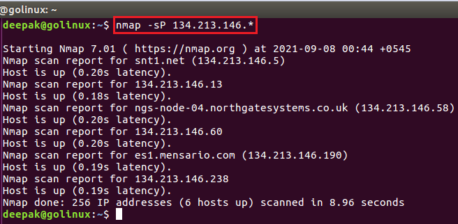|
|`nmap 192.168.1.1 -sA`|Scan and Detect Firewall|
||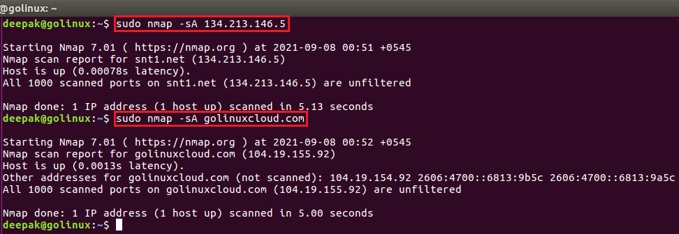|
|`nmap 192.168.1.1 -PN`|Check if Host Protected by Firewall|
||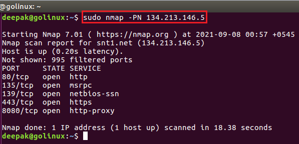|
|`nmap 192.168.1.1 --iflist`|List Interfaces and Routes|
||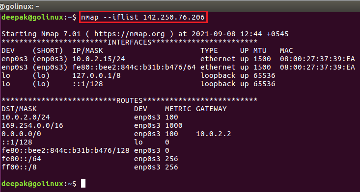|
|`nmap 192.168.1.0/24 -sn`|	Host Discovery (Disable port scan)|
|`nmap 192.168.1.1 -p-`|Scan Opened Ports|

## OS Detection
| Command | Description |
|---|---|
|`nmap -A -T3 cloudflare.com`| Scan Ports and Services using **Aggresive** mode|
||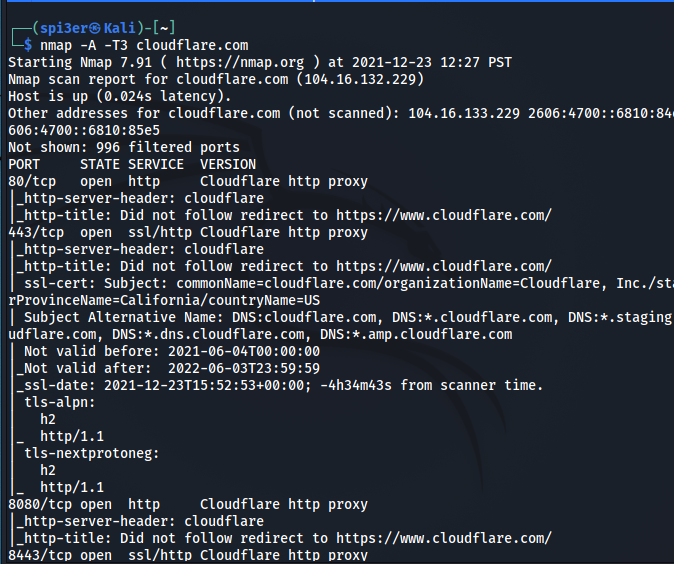|
|`nmap -O cloudflare.com`| Get OS information |
||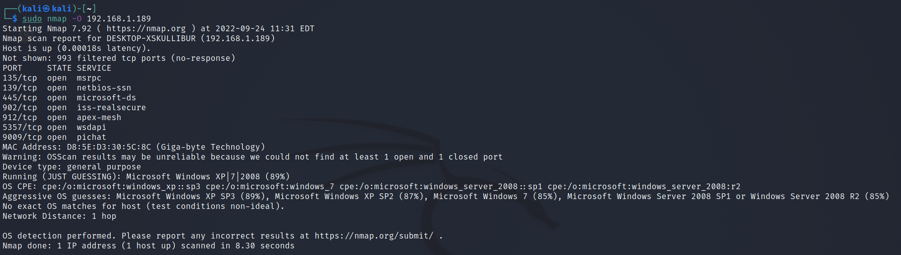|

## Service Detection
| Command | Description |
|---|---|
|`nmap -sV cloudflare.com`| Scan Services Only|
||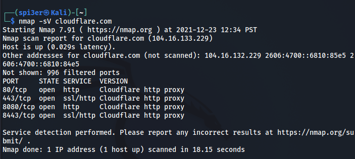|

## CVE Detection
| Command | Description |
|---|---|
|`nmap -Pn --script vuln cloudflare.com`| Full Vulnerability Scan |
||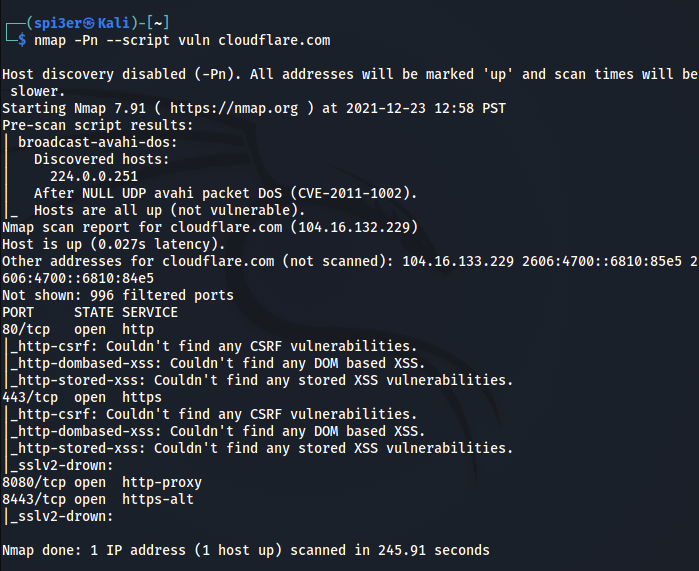|
|`nmap --script exploit cloudflare.com`| Exploit Using Identified CVE |